# 🏥 Hospital Management System using PostgreSQL

## 📌 Project Overview

This project is a **Hospital Management System Database** developed using **PostgreSQL** and **pgAdmin 4**. It demonstrates relational database design, data management, and SQL querying through a real-world healthcare scenario.

The project consists of **8 interconnected tables** with **Primary Keys** and **Foreign Keys**, along with sample data and business-oriented SQL queries for analysis.

---

## 🛠️ Technologies Used

* PostgreSQL
* pgAdmin 4
* SQL
* GitHub

---

## 📂 Database Schema

The database contains the following tables:

* Departments
* Doctors
* Patients
* Appointments
* Treatments
* Bills
* Medicines
* Prescriptions

---

## 🔗 ER Diagram

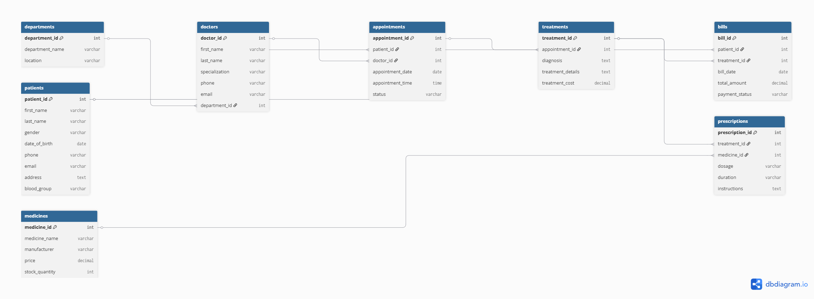

---

## 📊 Features

* Relational Database Design
* Primary & Foreign Key Constraints
* Data Insertion and Management
* SQL JOIN Operations
* Aggregate Functions
* GROUP BY & HAVING
* Subqueries
* Window Functions
* Common Table Expressions (CTEs)
* Business-Oriented Analytics Queries

---

# 📸 Project Screenshots

## Database Overview

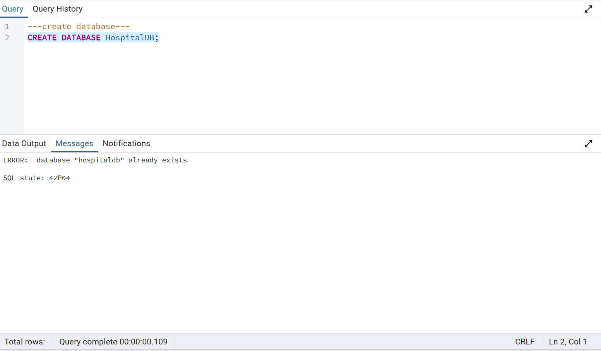

---

## Departments Table

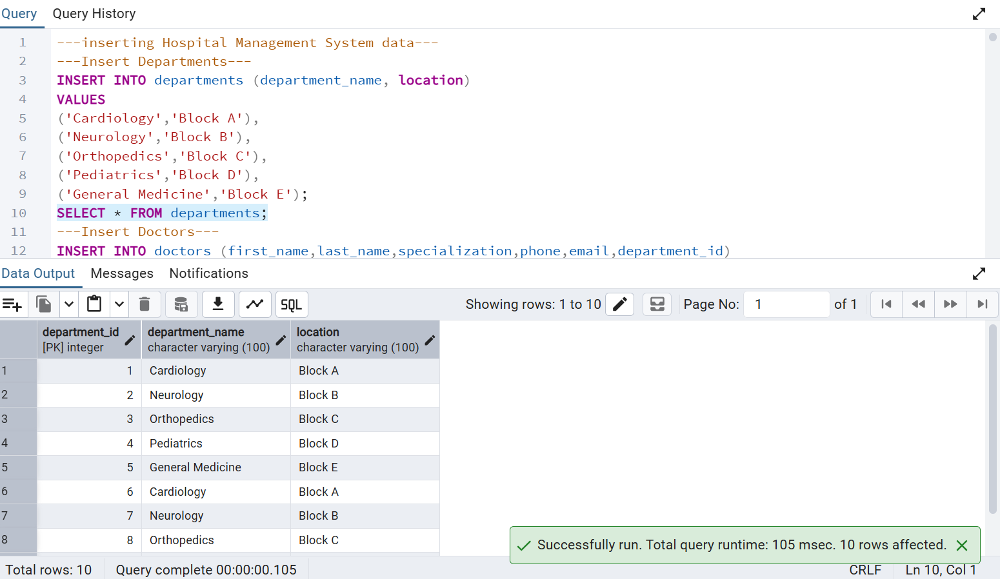

---

## Doctors Table

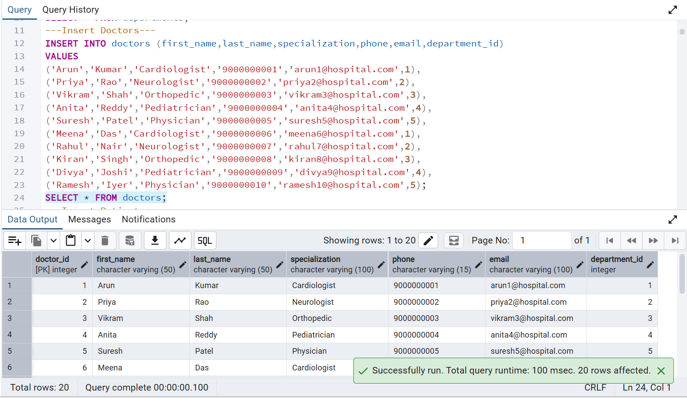

---

## Patients Table

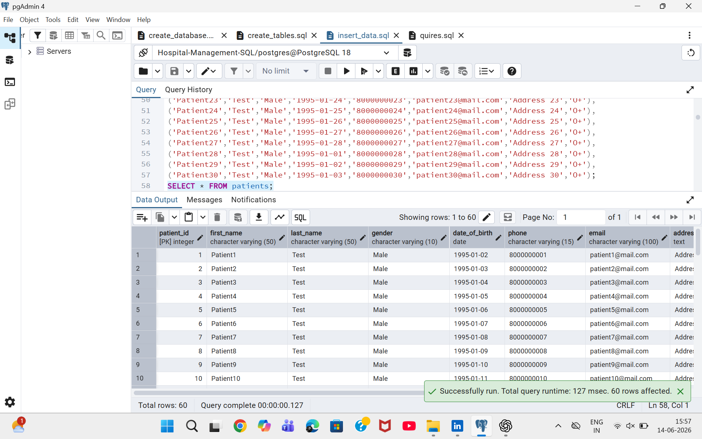

---

## Appointments Table

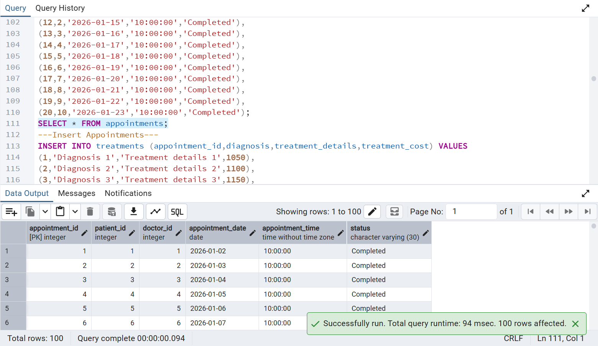

---

## Bills Table

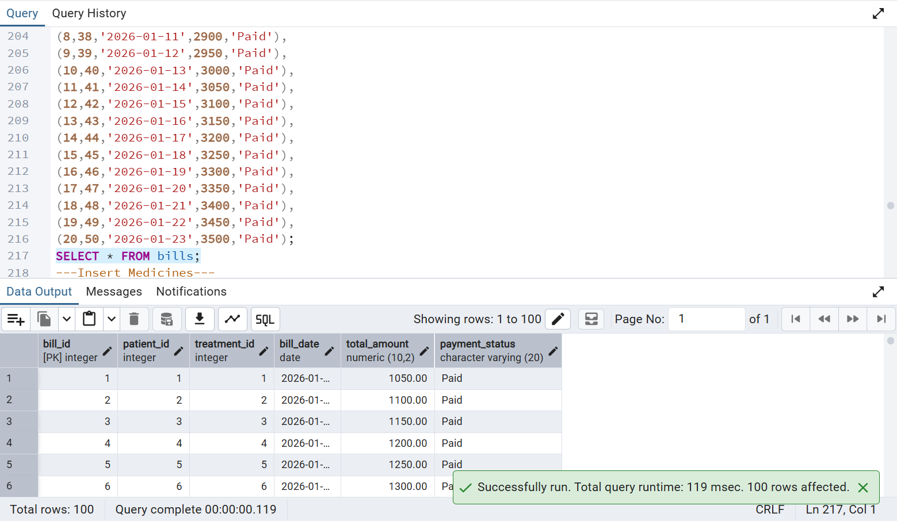

---

## Medicines Table

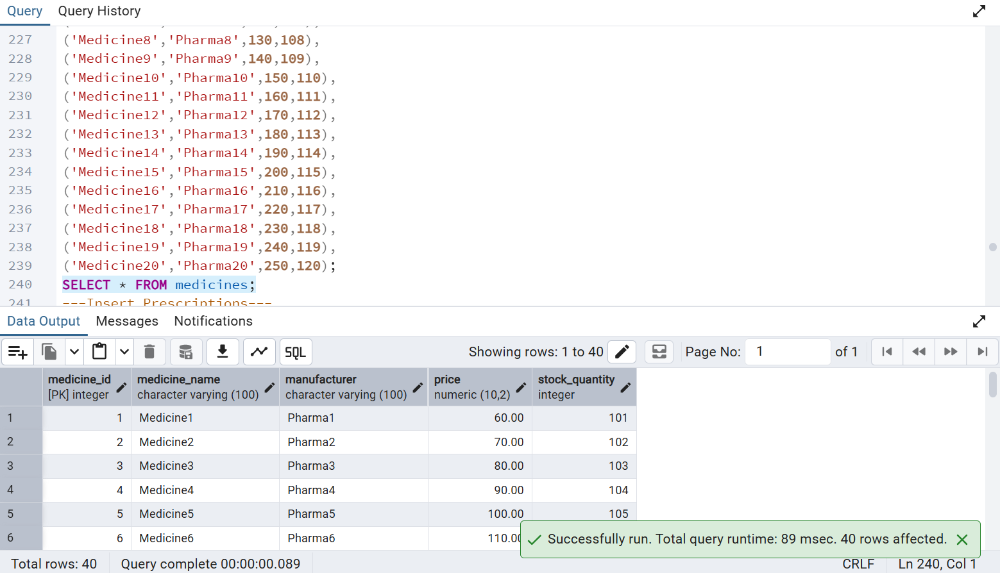

---

## Prescriptions Table

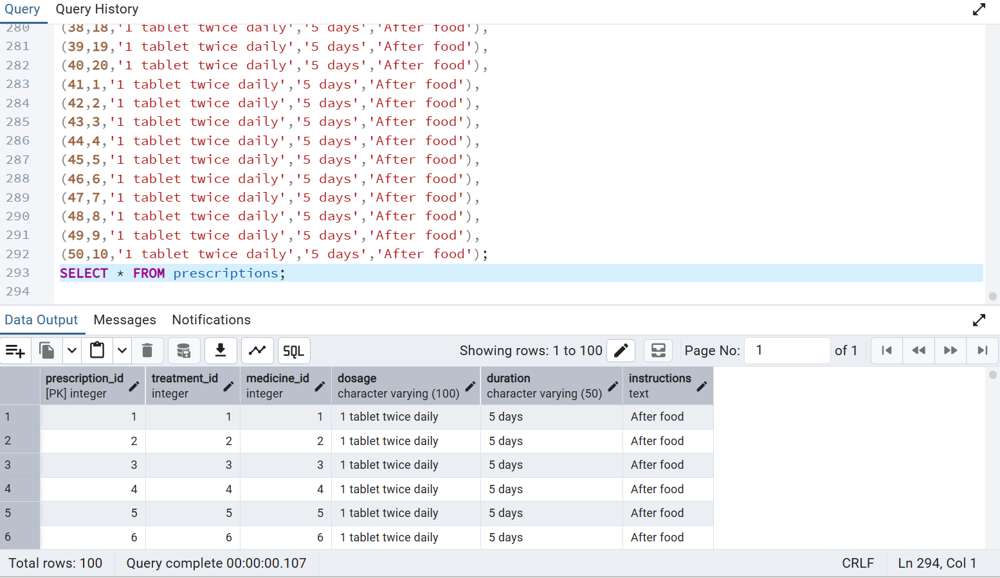

---

## Sample Query: Total Patients

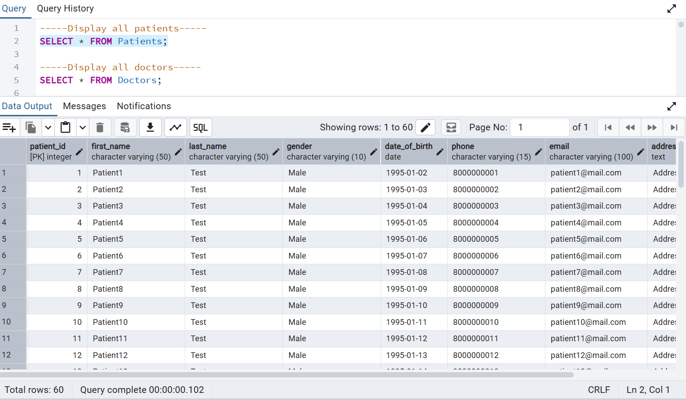

---

## Sample Query: Doctor Appointments

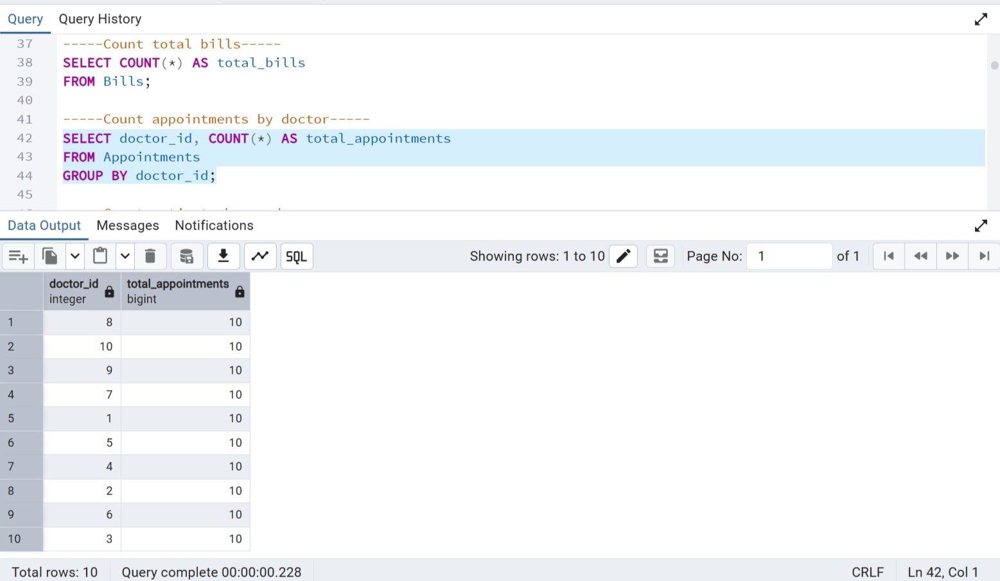

---

## Sample Query: Pending Bills

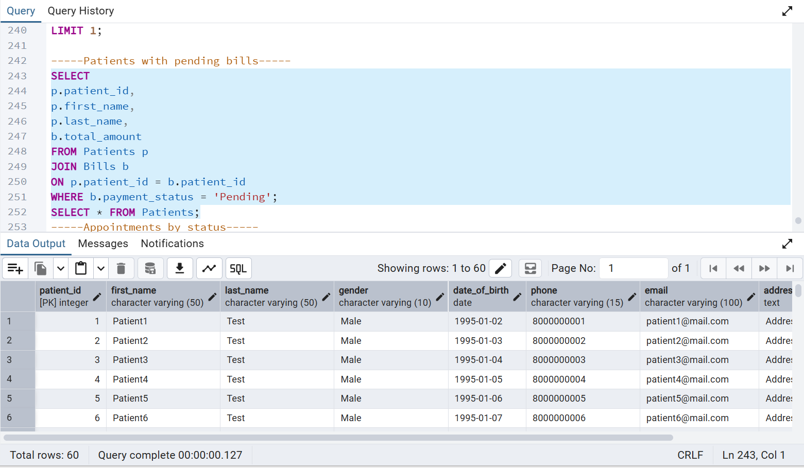

---

## 📈 SQL Concepts Used

* CREATE TABLE
* INSERT INTO
* SELECT
* WHERE
* ORDER BY
* GROUP BY
* HAVING
* INNER JOIN
* LEFT JOIN
* RIGHT JOIN
* Aggregate Functions
* Subqueries
* CTEs
* Window Functions

---

## 🎯 Learning Outcomes

* Designed a normalized relational database
* Implemented entity relationships using foreign keys
* Performed advanced SQL queries for reporting and analysis
* Practiced real-world database management using PostgreSQL
* Built a portfolio-ready SQL project for GitHub and LinkedIn

---

## 🚀 Future Enhancements

* Add Triggers and Stored Procedures
* Implement Views for Reporting
* Integrate with a Web Application
* Create Interactive Dashboards using Power BI or Tableau

---

## 👩‍💻 Author

**Kapa Sri Lakshmi**

Aspiring Data Analyst | SQL | PostgreSQL | Excel | Python | AI Enthusiast

---

⭐ If you found this project useful, don't forget to **Star** this repository!
